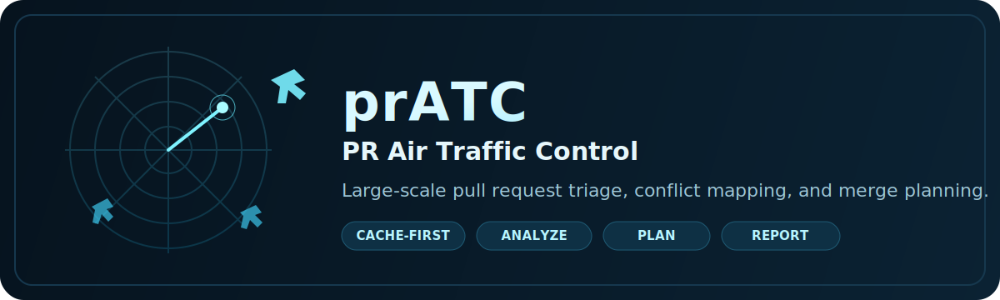

# prATC

<p align="center">
  
</p>

<p align="center">
  <strong>PR Air Traffic Control for repositories that have outgrown manual triage.</strong>
</p>

<p align="center">
  <a href="CHANGELOG.md"></a>
  <a href="RATELIMITS.md"></a>
  <a href="LICENSE"></a>
  <a href="INSTALL.md"></a>
</p>

<p align="center">
  <a href="#about">About</a> ·
  <a href="#quick-start">Quick Start</a> ·
  <a href="#features">Features</a> ·
  <a href="#documentation">Docs</a> ·
  <a href="#configuration">Config</a> ·
  <a href="#testing">Testing</a> ·
  <a href="#license">License</a>
</p>

## About

prATC (PR Air Traffic Control) is a self-hostable system for large-scale pull request triage and merge planning.

It gives you a cache-first workflow for repositories with hundreds or thousands of PRs, then turns that corpus into something navigable: duplicate groups, conflict maps, ranked merge queues, and a PDF report you can hand to humans.

Use it when "just open the PR list" has stopped being a serious plan.

## Project Status

- **Current release line:** `1.6.0`
- **Validation status:** cache-first and explicit live full-corpus workflows are audit-green against `openclaw/openclaw` (`6,632` PRs, `17` required checks passing, `0` failures)
- **Default execution model:** cache-first local snapshot reuse; fresh sync happens only when you explicitly request `--refresh-sync` or `--force-live`
- **Default API port:** `7400` (reserved prATC range: `7400-7500`)

## Documentation

- [CHANGELOG.md](CHANGELOG.md) — Release history
- [ROADMAP.md](ROADMAP.md) — Current release status and next product phases
- [ARCHITECTURE.md](ARCHITECTURE.md) — System shape, data flow, and technical reference
- [GUIDELINE.md](GUIDELINE.md) — Bucket rules, layer ordering, and non-negotiables
- [INSTALL.md](INSTALL.md) — Installation and deployment guide
- [RATELIMITS.md](RATELIMITS.md) — GitHub budget behavior and cache-first operating guidance

## Features

- **CLI Analysis**: Analyze, cluster, graph, and plan merges for GitHub repositories
- **Cache-First Workflow**: Reuse the local SQLite snapshot by default; refresh or force-live only when explicitly requested
- **Garbage Classifier**: Automatically filters empty PRs, bot PRs, spam, and drafts before analysis
- **Duplicate Detection**: Exact scoring with MinHash/LSH candidate generation for large corpora, plus cache-backed preservation of truthful `0.80` duplicate groups
- **Conflict Graph**: Noise-filtered file overlap detection with severity scoring and generated-file suppression from live OpenClaw data
- **Substance Scoring**: 0-100 composite score with source-file impact, test coverage, freshness, diff footprint, and clean-finding weighting
- **Deep Judgment Layers**: 16-layer decision ladder (confidence, dependency, blast radius, leverage, ownership, stability, mergeability, strategic weight, attention cost, reversibility, signal quality)
- **Temporal Routing**: PRs split into `now`, `future`, and `blocked` buckets
- **Intermediate Caching**: Duplicate groups, conflict graph, and substance scores cached in SQLite with corpus fingerprinting
- **PDF Report**: Workflow-generated real PDF with executive summary, junk section, duplicate chains, near-duplicates, now/future/blocked queues, and full appendix
- **Preflight Check**: Estimate sync time and delta before committing to a long run
- **Singleton Lock**: Prevents concurrent prATC instances against the same repo
- **Repo Normalization**: Case-insensitive repo names (OpenClaw/openclaw → openclaw/openclaw)
- **Rate-Limit Aware**: Built-in retry, budget management, and auto-resume
- **API Server**: HTTP API for AI agents and external integrations (port 7400)

## Quick Start

```bash
# Build
go build -o ./bin/pratc ./cmd/pratc/

# Authenticate once (preferred over exporting tokens into shell history)
gh auth login

# Pre-flight check (estimate before syncing)
./bin/pratc preflight --repo=owner/repo

# Default full workflow (cache-first; reuses local snapshot when available)
./bin/pratc workflow --repo=owner/repo --progress

# Analyze from cache only
./bin/pratc analyze --repo=owner/repo --force-cache --format=json

# Explicit live validation path (fresh sync + live analyze)
./bin/pratc workflow --repo=owner/repo --refresh-sync --force-live --progress

# Generate PDF report from a run directory
./bin/pratc report --repo=owner/repo --input-dir=projects/<repo>/runs/<timestamp>

# API server
./bin/pratc serve --port=7400
```

## CLI Commands

### preflight
Pre-flight check for repository sync planning. Estimates delta, API calls, time, and rate limit status.

```bash
pratc preflight --repo=owner/repo
```

Output:
```
Preflight for openclaw/openclaw
Cache:          6,646 PRs
GitHub:         19,241 open PRs
Delta:          12,595 PRs to fetch
Rate limit:     4999 remaining (resets in 18:32 UTC)
Est. API calls: ~25,316
Est. time:      ~5.3 hours (at 4800 req/hr)
Lock status:    clear (no other prATC instance running)
```

### analyze
Analyze pull requests for a repository.

```bash
pratc analyze --repo=owner/repo --format=json
pratc analyze --repo=owner/repo --force-cache           # Skip sync, use cached data
pratc analyze --repo=owner/repo --use-cache-first        # Prefer cache, sync if stale
pratc analyze --repo=owner/repo --max-prs=1000           # Cap analysis at 1000 PRs
```

### workflow
Run sync to completion, then analyze, cluster, graph, plan, and generate a real PDF report.
Cache-first is the default behavior; workflow reuses the local snapshot unless you explicitly ask for a fresh live run.

```bash
./bin/pratc workflow --repo=owner/repo --progress
./bin/pratc workflow --repo=owner/repo --refresh-sync --force-live --progress
```

### sync
Sync repository metadata and refs.

```bash
pratc sync --repo=owner/repo
pratc sync --repo=owner/repo --sync-max-prs=200          # Cap initial fetch
pratc sync --repo=owner/repo --refresh-sync              # Force fresh sync
```

### cluster
Cluster pull requests by similarity.

```bash
pratc cluster --repo=owner/repo --format=json
```

### graph
Generate dependency/conflict graphs.

```bash
pratc graph --repo=owner/repo --format=dot
pratc graph --repo=owner/repo --format=json
```

### plan
Generate a ranked merge plan. Dry-run by default.

```bash
pratc plan --repo=owner/repo --target=20
pratc plan --repo=owner/repo --target=20 --mode=combination
```

### report
Generate PDF report from workflow artifacts.

```bash
pratc report --repo=owner/repo --input-dir=projects/<repo>/runs/<timestamp> --output=report.pdf
```

### serve
Start the API server.

```bash
pratc serve --port=7400
```

### audit
Query the audit log.

```bash
pratc audit --limit=20 --format=json
```

## Triage Pipeline

The analysis pipeline processes PRs through layered decision stages:

```
Garbage classifier (empty, bot, spam, draft)
    ↓
Duplicate detection (pairwise similarity, threshold 0.85)
    ↓
Conflict graph (noise-filtered file overlap, severity scoring)
    ↓
Substance scoring (0-100: file depth, tests, freshness, findings)
    ↓
Temporal routing (now / future / blocked)
    ↓
Deep judgment (16 layers: confidence, dependency, blast radius, ...)
    ↓
Review pipeline (security, reliability, performance analyzers)
    ↓
PDF report (executive summary → junk → dupes → now → review → future → appendix)
```

Every PR is accounted for. Every decision carries a reason code. No PR vanishes without an explanation.

## Repository Layout

```text
cmd/pratc/          CLI entrypoints
internal/
  app/              Service layer, pipeline orchestration, garbage/duplicate/conflict logic
  cache/            SQLite persistence (schema v7, intermediate caching)
  cmd/              CLI command implementations (preflight, lock, sync, analyze, ...)
  github/           GitHub client with auth passthrough
  graph/            Dependency graph engine
  planning/         Pool selection, hierarchical planning, pairwise executor
  report/           PDF generation (analyst sections, near-duplicate detail)
  review/           Deep judgment layers, substance scoring, temporal routing
  sync/             Background sync, rate-limit guard, bootstrap streaming
  types/            Shared types, constants, repo normalization
ml-service/         Python ML service
web/                TypeScript Next.js dashboard (deprecated — not part of v1.6 product surface)
fixtures/           Test fixtures
projects/           Persistent workflow runs and PDF reports
```

## Configuration

| Variable | Description |
|----------|-------------|
| `PRATC_PORT` | API server port (default: 7400) |
| `PRATC_DB_PATH` | SQLite database path (default: ~/.pratc/pratc.db) |
| `PRATC_SETTINGS_DB` | Settings database path |
| `GITHUB_TOKEN` | GitHub API token (falls back to `gh auth token`) |

## Auth

prATC resolves GitHub tokens in order:
1. `GITHUB_TOKEN` / `GH_TOKEN` / `GITHUB_PAT` environment variable
2. `gh auth token` (from logged-in `gh` CLI session)

## Testing

```bash
# Restore public open-PR fixtures used by fixture-backed tests
python3 scripts/fetch_fixtures.py --repo opencode-ai/opencode --limit 100

go test ./...
go test -race -v ./...
go vet ./...
```

## License

FSL-1.1-Apache-2.0 (non-commercial, converts to Apache 2.0 after 2 years)
