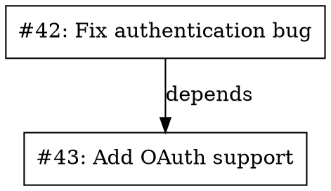

# prATC API Contracts Guide

**Last Updated:** 2026-03-23  
**System Version:** v0.1  
**Base URL:** `http://localhost:8080` (configurable via `PRATC_PORT`)

## Table of Contents

1. [Overview](#overview)
2. [Common Patterns](#common-patterns)
3. [Health Endpoints](#health-endpoints)
4. [Analysis Endpoints](#analysis-endpoints)
5. [Clustering Endpoints](#clustering-endpoints)
6. [Graph Endpoints](#graph-endpoints)
7. [Planning Endpoints](#planning-endpoints)
8. [Sync Endpoints](#sync-endpoints)
9. [Settings Endpoints](#settings-endpoints)
10. [Error Responses](#error-responses)
11. [Type Reference](#type-reference)

---

## Overview

prATC exposes a RESTful API for PR analysis, clustering, graphing, and planning. All responses include `repo` and `generatedAt` fields. Error responses follow a standard format.

### Base URL

```
http://localhost:8080
```

### Content Type

All requests and responses use `application/json` unless otherwise specified.

### Authentication

**Note:** No authentication is currently implemented. Run behind a reverse proxy for production use.

---

## Common Patterns

### Response Structure

**Success response:**
```json
{
  "repo": "owner/repo",
  "generatedAt": "2026-03-23T10:30:00Z",
  "...": "operation-specific fields"
}
```

**Error response:**
```json
{
  "error": "error_description"
}
```

### Repository Format

All endpoints accept repositories in `owner/repo` format:
- `opencode-ai/opencode`
- `kubernetes/kubernetes`

### Legacy vs RESTful Routes

Two route styles are supported:

**Legacy (query string):**
```
GET /analyze?repo=owner/repo
```

**RESTful:**
```
GET /api/repos/owner/repo/analyze
```

Both return identical responses. Use RESTful routes for new development.

---

## Health Endpoints

### GET /healthz

Health check endpoint.

**Response:**
```json
{
  "status": "healthy",
  "version": "0.1.0"
}
```

**Status codes:**
- 200: Service healthy

### GET /api/health

Alias for `/healthz`.

**Response:** Same as `/healthz`

---

## Analysis Endpoints

### GET /api/repos/{owner}/{repo}/analyze

Full PR analysis including clusters, duplicates, conflicts, and staleness.

**Parameters:**
- `owner` (path): Repository owner
- `repo` (path): Repository name

**Response:**
```json
{
  "repo": "owner/repo",
  "generatedAt": "2026-03-23T10:30:00Z",
  "analysisTruncated": false,
  "truncationReason": "",
  "maxPRsApplied": 0,
  "prWindow": {
    "beginningPRNumber": 1,
    "endingPRNumber": 100
  },
  "precisionMode": "standard",
  "deepCandidateSubsetSize": 0,
  "counts": {
    "total_prs": 42,
    "cluster_count": 5,
    "duplicate_groups": 2,
    "overlap_groups": 3,
    "conflict_pairs": 1,
    "stale_prs": 4
  },
  "prs": [
    {
      "id": "123",
      "repo": "owner/repo",
      "number": 42,
      "title": "Fix authentication bug",
      "body": "This PR fixes the auth issue...",
      "url": "https://github.com/owner/repo/pull/42",
      "author": "alice",
      "labels": ["bug", "security"],
      "files_changed": ["src/auth.go", "src/middleware.go"],
      "review_status": "approved",
      "ci_status": "success",
      "mergeable": "mergeable",
      "base_branch": "main",
      "head_branch": "fix-auth",
      "cluster_id": "cluster-001",
      "created_at": "2026-03-20T10:00:00Z",
      "updated_at": "2026-03-22T14:30:00Z",
      "is_draft": false,
      "is_bot": false,
      "additions": 150,
      "deletions": 30,
      "changed_files_count": 2
    }
  ],
  "clusters": [
    {
      "cluster_id": "cluster-001",
      "cluster_label": "Authentication",
      "summary": "PRs related to authentication and authorization",
      "pr_ids": [42, 43, 44],
      "health_status": "healthy",
      "average_similarity": 0.85,
      "sample_titles": ["Fix auth bug", "Add OAuth support", "Update login flow"]
    }
  ],
  "duplicates": [
    {
      "canonical_pr_number": 42,
      "duplicate_pr_numbers": [45],
      "similarity": 0.95,
      "reason": "Identical code changes"
    }
  ],
  "overlaps": [
    {
      "canonical_pr_number": 42,
      "duplicate_pr_numbers": [46, 47],
      "similarity": 0.78,
      "reason": "Touches same files"
    }
  ],
  "conflicts": [
    {
      "source_pr": 42,
      "target_pr": 48,
      "conflict_type": "file_conflict",
      "files_touched": ["src/auth.go"],
      "severity": "high",
      "reason": "Both modify src/auth.go"
    }
  ],
  "stalenessSignals": [
    {
      "pr_number": 10,
      "score": 0.85,
      "signals": ["old", "conflicts", "failing_ci"],
      "reasons": ["Last updated 30 days ago", "Has merge conflicts", "CI failing"],
      "superseded_by": [42]
    }
  ],
  "telemetry": {
    "pool_strategy": "weighted",
    "pool_size_before": 100,
    "pool_size_after": 42,
    "graph_delta_edges": 15,
    "decay_policy": "exponential",
    "pairwise_shards": 4,
    "stage_latencies_ms": {
      "fetch": 1000,
      "filter": 500,
      "cluster": 2000
    },
    "stage_drop_counts": {
      "draft": 5,
      "conflict": 3,
      "ci_fail": 2
    }
  }
}
```

**Status codes:**
- 200: Success
- 400: Missing repo parameter
- 404: Route not found
- 500: Internal error

### GET /analyze

Legacy query-string version.

**Parameters:**
- `repo` (query, required): Repository in owner/repo format

**Response:** Same as `/api/repos/{owner}/{repo}/analyze`

---

## Clustering Endpoints

### GET /api/repos/{owner}/{repo}/cluster

ML-based PR clustering only (without full analysis).

**Parameters:**
- `owner` (path): Repository owner
- `repo` (path): Repository name

**Response:**
```json
{
  "repo": "owner/repo",
  "generatedAt": "2026-03-23T10:30:00Z",
  "analysisTruncated": false,
  "truncationReason": "",
  "maxPRsApplied": 0,
  "prWindow": {
    "beginningPRNumber": 1,
    "endingPRNumber": 100
  },
  "precisionMode": "standard",
  "deepCandidateSubsetSize": 0,
  "model": "hdbscan",
  "thresholds": {
    "duplicate": 0.9,
    "overlap": 0.7
  },
  "clusters": [
    {
      "cluster_id": "cluster-001",
      "cluster_label": "Authentication",
      "summary": "PRs related to authentication",
      "pr_ids": [42, 43, 44],
      "health_status": "healthy",
      "average_similarity": 0.85,
      "sample_titles": ["Fix auth", "Add OAuth", "Update login"]
    }
  ]
}
```

**Status codes:**
- 200: Success
- 400: Missing repo parameter
- 500: Internal error

### GET /cluster

Legacy query-string version.

**Parameters:**
- `repo` (query, required): Repository in owner/repo format

**Response:** Same as `/api/repos/{owner}/{repo}/cluster`

---

## Graph Endpoints

### GET /api/repos/{owner}/{repo}/graph

Generate dependency/conflict graph.

**Parameters:**
- `owner` (path): Repository owner
- `repo` (path): Repository name
- `format` (query, optional): `json` (default) or `dot`

**JSON Response:**
```json
{
  "repo": "owner/repo",
  "generatedAt": "2026-03-23T10:30:00Z",
  "nodes": [
    {
      "pr_number": 42,
      "title": "Fix authentication bug",
      "cluster_id": "cluster-001",
      "ci_status": "success"
    },
    {
      "pr_number": 43,
      "title": "Add OAuth support",
      "cluster_id": "cluster-001",
      "ci_status": "pending"
    }
  ],
  "edges": [
    {
      "from_pr": 42,
      "to_pr": 43,
      "edge_type": "dependency",
      "reason": "PR 43 depends on changes in PR 42"
    },
    {
      "from_pr": 42,
      "to_pr": 48,
      "edge_type": "conflict",
      "reason": "Both modify src/auth.go"
    }
  ],
  "dot": "digraph { ... }",
  "telemetry": {
    "pool_strategy": "weighted",
    "graph_delta_edges": 15
  }
}
```

**DOT Response** (when `format=dot`):


**Status codes:**
- 200: Success
- 400: Missing repo parameter
- 500: Internal error

### GET /graph

Legacy query-string version.

**Parameters:**
- `repo` (query, required): Repository in owner/repo format
- `format` (query, optional): `json` or `dot`

**Response:** Same as `/api/repos/{owner}/{repo}/graph`

---

## Planning Endpoints

### GET /api/repos/{owner}/{repo}/plan

Generate a ranked merge plan.

**Parameters:**
- `owner` (path): Repository owner
- `repo` (path): Repository name
- `target` (query, optional): Number of PRs to include (default: 20, min: 1)
- `mode` (query, optional): Formula mode (default: `combination`)
  - `combination`: C(n,k) — select k from n without order
  - `permutation`: P(n,k) — select k from n with order
  - `with_replacement`: n^k — select with replacement
- `cluster_id` (query, optional): Filter to specific cluster (reserved)
- `exclude_conflicts` (query, optional): Exclude conflicting PRs (default: false)
- `stale_score_threshold` (query, optional): Staleness threshold 0-1 (default: 0.0)
- `candidate_pool_cap` (query, optional): Max candidate pool size 1-500 (default: 100)
- `score_min` (query, optional): Minimum PR score 0-100 (default: 0.0)
- `dry_run` (query, optional): Plan only, do not execute (default: true)

**Response:**
```json
{
  "repo": "owner/repo",
  "generatedAt": "2026-03-23T10:30:00Z",
  "analysisTruncated": false,
  "truncationReason": "",
  "maxPRsApplied": 0,
  "prWindow": {
    "beginningPRNumber": 1,
    "endingPRNumber": 100
  },
  "precisionMode": "standard",
  "deepCandidateSubsetSize": 0,
  "target": 20,
  "candidatePoolSize": 42,
  "strategy": "combination",
  "selected": [
    {
      "pr_number": 42,
      "title": "Fix authentication bug",
      "score": 95.5,
      "rationale": "High priority, ready to merge, no conflicts",
      "files_touched": ["src/auth.go", "src/middleware.go"],
      "conflict_warnings": []
    },
    {
      "pr_number": 43,
      "title": "Add OAuth support",
      "score": 88.2,
      "rationale": "Important feature, minor feedback to address",
      "files_touched": ["src/oauth.go"],
      "conflict_warnings": ["May conflict with PR #42"]
    }
  ],
  "ordering": [
    {
      "pr_number": 42,
      "title": "Fix authentication bug",
      "score": 95.5,
      "rationale": "Merge first (no dependencies)",
      "files_touched": ["src/auth.go"],
      "conflict_warnings": []
    },
    {
      "pr_number": 43,
      "title": "Add OAuth support",
      "score": 88.2,
      "rationale": "Merge second (depends on PR #42)",
      "files_touched": ["src/oauth.go"],
      "conflict_warnings": []
    }
  ],
  "rejections": [
    {
      "pr_number": 10,
      "reason": "Stale (30+ days), failing CI, merge conflicts"
    },
    {
      "pr_number": 15,
      "reason": "Draft PR, incomplete implementation"
    }
  ],
  "telemetry": {
    "pool_strategy": "weighted",
    "pool_size_before": 100,
    "pool_size_after": 42,
    "decay_policy": "exponential",
    "stage_latencies_ms": {
      "filter": 100,
      "score": 200,
      "plan": 500
    }
  }
}
```

**Status codes:**
- 200: Success
- 400: Invalid parameters
- 500: Internal error

### GET /plan

Legacy query-string version.

**Parameters:** Same as RESTful version, plus:
- `repo` (query, required): Repository in owner/repo format

**Response:** Same as `/api/repos/{owner}/{repo}/plan`

---

## Sync Endpoints

### POST /api/repos/{owner}/{repo}/sync

Trigger a background sync job.

**Parameters:**
- `owner` (path): Repository owner
- `repo` (path): Repository name

**Response:**
```json
{
  "started": true,
  "repo": "owner/repo"
}
```

**Status codes:**
- 202: Accepted (sync started)
- 500: Sync API unavailable or error

### GET /api/repos/{owner}/{repo}/sync/stream

Stream sync progress via Server-Sent Events (SSE).

**Parameters:**
- `owner` (path): Repository owner
- `repo` (path): Repository name

**Response:** SSE stream with events:

```
event: progress
data: {"processed": 100, "total": 5500, "percent": 1.8}

event: complete
data: {"status": "completed", "processed": 5500, "total": 5500}

event: error
data: {"status": "failed", "error": "rate limit exceeded"}
```

**Status codes:**
- 200: SSE stream
- 500: Sync API unavailable

### GET /api/repos/{owner}/{repo}/sync/status

Get current sync status.

**Parameters:**
- `owner` (path): Repository owner
- `repo` (path): Repository name

**Response:**
```json
{
  "repo": "owner/repo",
  "last_sync": "2026-03-23T09:00:00Z",
  "pr_count": 5500
}
```

Or if never synced:
```json
{
  "repo": "owner/repo",
  "last_sync": null,
  "pr_count": 0
}
```

**Status codes:**
- 200: Success

---

## Settings Endpoints

### GET /api/settings

Get settings for a repository.

**Parameters:**
- `repo` (query, optional): Repository in owner/repo format. Omit for global settings.

**Response:**
```json
{
  "weights": {
    "review_approval": 10,
    "ci_pass": 5,
    "no_conflicts": 3
  },
  "thresholds": {
    "duplicate": 0.9,
    "overlap": 0.7
  },
  "sync": {
    "interval_minutes": 60
  }
}
```

**Status codes:**
- 200: Success
- 500: Database error

### POST /api/settings

Set a setting value.

**Query Parameters:**
- `validateOnly` (query, optional): If `true`, validates without writing

**Request Body:**
```json
{
  "scope": "repo",
  "repo": "owner/repo",
  "key": "weights.review_approval",
  "value": 15
}
```

**Scope values:**
- `global`: Global settings (repo field ignored)
- `repo`: Repository-specific settings

**Response (normal):**
```json
{
  "updated": true
}
```

**Response (validateOnly=true):**
```json
{
  "valid": true
}
```

**Status codes:**
- 200: Success
- 400: Invalid request (missing key, invalid value)
- 500: Database error

### DELETE /api/settings

Delete a setting.

**Query Parameters:**
- `scope` (query, required): `global` or `repo`
- `repo` (query, optional): Repository (required for scope=repo)
- `key` (query, required): Setting key to delete

**Response:**
```json
{
  "deleted": true
}
```

**Status codes:**
- 200: Success
- 400: Missing key or invalid scope
- 500: Database error

### GET /api/settings/export

Export settings as YAML.

**Query Parameters:**
- `scope` (query, optional): `global` or `repo`. Omit for all.
- `repo` (query, optional): Repository filter

**Response:**
```yaml
weights:
  review_approval: 10
  ci_pass: 5
thresholds:
  duplicate: 0.9
  overlap: 0.7
```

**Content-Type:** `application/x-yaml`

**Status codes:**
- 200: Success
- 400: Invalid scope

### POST /api/settings/import

Import settings from YAML.

**Query Parameters:**
- `scope` (query, optional): Target scope
- `repo` (query, optional): Target repo

**Request Body:** YAML content (max 1MB)

```yaml
weights:
  review_approval: 15
  ci_pass: 8
```

**Response:**
```json
{
  "imported": true
}
```

**Status codes:**
- 200: Success
- 400: Invalid YAML or settings
- 413: Request body too large (>1MB)

---

## Error Responses

### Format

All errors return JSON:

```json
{
  "error": "error description"
}
```

### Status Codes

| Code | Usage |
|------|-------|
| 200 OK | Successful GET, POST with result |
| 202 Accepted | Async operation started (sync trigger) |
| 400 Bad Request | Invalid parameters, validation errors |
| 404 Not Found | Route not found |
| 405 Method Not Allowed | Wrong HTTP method |
| 413 Payload Too Large | Request body > 1MB (settings import) |
| 500 Internal Server Error | Service errors, unexpected failures |

### Validation Errors

Multiple validation errors are joined with `; `:

```json
{
  "error": "target must be a positive integer; stale_score_threshold must be between 0 and 1"
}
```

---

## Type Reference

### PR

```typescript
interface PR {
  id: string;
  repo: string;
  number: number;
  title: string;
  body: string;
  url: string;
  author: string;
  labels: string[];
  files_changed: string[];
  review_status: string;
  ci_status: string;
  mergeable: string;
  base_branch: string;
  head_branch: string;
  cluster_id: string;
  created_at: string;      // RFC3339
  updated_at: string;      // RFC3339
  is_draft: boolean;
  is_bot: boolean;
  additions: number;
  deletions: number;
  changed_files_count: number;
}
```

### PRCluster

```typescript
interface PRCluster {
  cluster_id: string;
  cluster_label: string;
  summary: string;
  pr_ids: number[];
  health_status: string;
  average_similarity: number;
  sample_titles: string[];
}
```

### DuplicateGroup

```typescript
interface DuplicateGroup {
  canonical_pr_number: number;
  duplicate_pr_numbers: number[];
  similarity: number;
  reason: string;
}
```

### ConflictPair

```typescript
interface ConflictPair {
  source_pr: number;
  target_pr: number;
  conflict_type: string;
  files_touched: string[];
  severity: string;
  reason: string;
}
```

### StalenessReport

```typescript
interface StalenessReport {
  pr_number: number;
  score: number;
  signals: string[];
  reasons: string[];
  superseded_by: number[];
}
```

### MergePlanCandidate

```typescript
interface MergePlanCandidate {
  pr_number: number;
  title: string;
  score: number;
  rationale: string;
  files_touched: string[];
  conflict_warnings: string[];
}
```

### PlanResponse

```typescript
interface PlanResponse {
  repo: string;
  generatedAt: string;
  target: number;
  candidatePoolSize: number;
  strategy: string;
  selected: MergePlanCandidate[];
  ordering: MergePlanCandidate[];
  rejections: PlanRejection[];
  telemetry?: OperationTelemetry;
}
```

### GraphResponse

```typescript
interface GraphResponse {
  repo: string;
  generatedAt: string;
  nodes: GraphNode[];
  edges: GraphEdge[];
  dot: string;
  telemetry?: OperationTelemetry;
}

interface GraphNode {
  pr_number: number;
  title: string;
  cluster_id: string;
  ci_status: string;
}

interface GraphEdge {
  from_pr: number;
  to_pr: number;
  edge_type: string;
  reason: string;
}
```

### AnalysisResponse

```typescript
interface AnalysisResponse {
  repo: string;
  generatedAt: string;
  counts: Counts;
  prs: PR[];
  clusters: PRCluster[];
  duplicates: DuplicateGroup[];
  overlaps: DuplicateGroup[];
  conflicts: ConflictPair[];
  stalenessSignals: StalenessReport[];
  telemetry?: OperationTelemetry;
}

interface Counts {
  total_prs: number;
  cluster_count: number;
  duplicate_groups: number;
  overlap_groups: number;
  conflict_pairs: number;
  stale_prs: number;
}
```

### OperationTelemetry

```typescript
interface OperationTelemetry {
  pool_strategy?: string;
  pool_size_before?: number;
  pool_size_after?: number;
  graph_delta_edges?: number;
  decay_policy?: string;
  pairwise_shards?: number;
  stage_latencies_ms?: Record<string, number>;
  stage_drop_counts?: Record<string, number>;
}
```

---

## CLI to API Mapping

| CLI Command | API Endpoint | Notes |
|-------------|--------------|-------|
| `pratc analyze --repo=X` | `GET /api/repos/X/analyze` | |
| `pratc cluster --repo=X` | `GET /api/repos/X/cluster` | |
| `pratc graph --repo=X` | `GET /api/repos/X/graph` | JSON format |
| `pratc graph --repo=X --format=dot` | `GET /api/repos/X/graph?format=dot` | DOT format |
| `pratc plan --repo=X --target=20` | `GET /api/repos/X/plan?target=20` | |
| `pratc sync --repo=X` | `POST /api/repos/X/sync` | Async trigger |
| `pratc sync --repo=X --watch` | `GET /api/repos/X/sync/stream` | SSE stream |

---

## Performance SLOs

For 5,500 PR scale with warm cache:

| Endpoint | p95 Latency |
|----------|-------------|
| GET /healthz | < 10ms |
| GET /api/repos/{r}/analyze | < 5s |
| GET /api/repos/{r}/cluster | < 3s |
| GET /api/repos/{r}/graph | < 2s |
| GET /api/repos/{r}/plan | < 2s |
| POST /api/repos/{r}/sync | < 100ms |

---

## Example Usage

### curl Examples

**Health check:**
```bash
curl http://localhost:8080/healthz
```

**Analyze repository:**
```bash
curl "http://localhost:8080/api/repos/opencode-ai/opencode/analyze"
```

**Generate plan:**
```bash
curl "http://localhost:8080/api/repos/opencode-ai/opencode/plan?target=10&mode=combination"
```

**Trigger sync:**
```bash
curl -X POST "http://localhost:8080/api/repos/opencode-ai/opencode/sync"
```

**Get settings:**
```bash
curl "http://localhost:8080/api/settings?repo=opencode-ai/opencode"
```

**Update setting:**
```bash
curl -X POST "http://localhost:8080/api/settings" \
  -H "Content-Type: application/json" \
  -d '{"scope":"repo","repo":"opencode-ai/opencode","key":"weights.review","value":10}'
```

**Stream sync progress:**
```bash
curl "http://localhost:8080/api/repos/opencode-ai/opencode/sync/stream"
```
